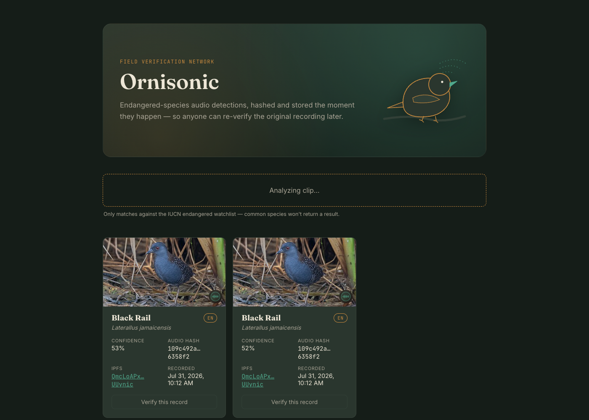
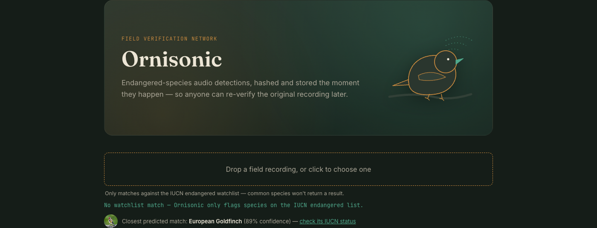

# Ornisonic

Live endangered-species audio detection, stored on IPFS with a re-hashable local record for tamper-evident verification.

## Screenshots

**Watchlist match** — a Black Rail call gets classified, hashed, and pinned to IPFS:



**No match** — nothing on the watchlist, so the UI shows BirdNET's closest real-bird guess instead of storing anything:



## Architecture

```
Audio upload
   -> BirdNET classification (backend/classifier.py)
   -> Filter against endangered watchlist (watchlist/watchlist.json)
   -> On match:
        -> Upload audio to IPFS via Pinata (backend/ipfs_client.py)
        -> Hash audio, store record (backend/main.py)
   -> Detection stored + queryable via FastAPI (backend/main.py)
   -> Anyone can re-hash the original audio and verify against the stored record
```

## Setup

### 1. Install dependencies
```bash
pip install -r requirements.txt
```

### 2. Get free API keys / accounts (all free tier)
- **Pinata** (IPFS storage): https://pinata.cloud -> API key + secret
- **IUCN Red List API** (species conservation status): https://apiv3.iucnredlist.org/api/v3/token -> free token

### 3. Set environment variables
Copy `.env.example` to `.env` and fill in:
```
PINATA_API_KEY=...
PINATA_SECRET_KEY=...
IUCN_TOKEN=...
```

### 4. Build the watchlist
```bash
python watchlist/build_watchlist.py
```
This cross-references IUCN Red List status against BirdNET's supported species and writes `watchlist/watchlist.json`.

### 5. Run the backend
```bash
uvicorn backend.main:app --reload
```

### 6. Test it
```bash
curl -X POST "http://localhost:8000/upload" -F "file=@sample.wav"
```

### 7. Run the frontend
With the backend running on port 8000:
```bash
cd frontend
npm install
npm run dev
```
Open http://localhost:5173 — the dev server proxies `/api/*` requests to the FastAPI backend, so no CORS setup is needed. Uploading a clip stores any endangered-species match and shows it as a card with its confidence, IPFS link, hash, and a verify button. If nothing on the watchlist matches, the UI instead shows BirdNET's closest real-bird prediction (with a thumbnail and a link to check its IUCN status) — nothing is stored in that case, since only watchlist matches get hashed and pinned to IPFS.

## Project layout
```
ornisonic/
├── watchlist/
│   └── build_watchlist.py     # IUCN + BirdNET overlap -> watchlist.json
├── backend/
│   ├── main.py                # FastAPI app: /upload, /detections, /verify
│   ├── classifier.py          # BirdNET wrapper
│   └── ipfs_client.py         # Pinata upload
├── frontend/                  # React (Vite) dashboard
│   ├── src/
│   │   ├── App.jsx
│   │   ├── api.js
│   │   └── components/
│   └── package.json
├── requirements.txt
└── .env.example
```

## Notes
- Start with short (5-10s) test clips; BirdNET works best on that length.
- `classify_audio` filters BirdNET detections at `min_confidence=0.5` (`backend/classifier.py`). This is lower than BirdNET's usual 0.7 default because secretive, endangered species (e.g. Black Rail) tend to score lower than common, loud ones even on a real call — a stricter threshold was filtering out genuine detections of the exact species this app is meant to catch.
